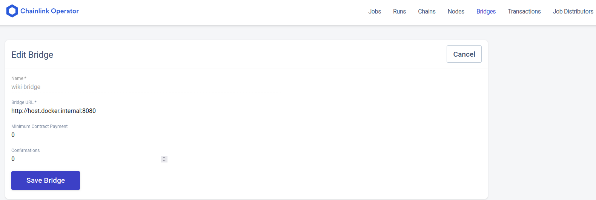

# Chainlink Node External Adapters Template
This guide provides an overview for clients looking to build and customize a Chainlink External Adapter. The client is responsible for defining the adapter logic to meet specific data requirements, while Rational Link will host and manage the supporting server infrastructure. Clients may choose to implement an external adapter when custom handling or parsing of API responses is needed before delivering data on-chain, or when cross-chain interoperability is required to write data to other blockchains.

This repository demonstrates how the adapter can be deployed and continuously executed using Docker or a local environment. It also outlines how the client can configure the corresponding Chainlink Node bridge and job, tailored to their account and job specifications. For smart contract integration, the ClientContract.sol file provides a working example of how to consume the adapter’s output on-chain.

If the client’s project requires more advanced customization, Rational Link offers collaborative development support for a fee, with flexible payment options—cryptocurrency preferred.


## Repository Structure
```
.
├── contract/
│   └── ClientContract.sol       # Sample smart contract for initiating requests
├── docker/
│   └── Dockerfile               # Docker image configuration for deployment
├── job/
│   └── wiki-ea.toml             # Chainlink Node job specification
├── src/
│   └── server.ts                # External Adapter logic — defined and maintained by the client and host by Rational Link
├── docker-compose.yml           # Container orchestration setup
├── package-lock.json            # Dependency lock file
├── package.json                 # Project metadata and scripts
├── tsconfig.json                # TypeScript configuration
└── README.md                    # Documentation and usage instructions
```
---

## Request Structure
The External Adapter is designed to receive a JSON payload in the following format. The example below demonstrates a request using Wikipedia as the data source:
```json
{
  "id": "12345",
  "data": {
    "titles": "Machine_learning",
    "exchars": "500"
  }
}
```
- id: A unique identifier for the job run.
- titles: The title of the Wikipedia article to query.
- exchars: The number of characters to extract from the article.

---
## Response Structure
Upon successful execution, the adapter returns a structured JSON response containing the requested data:
```json
{
  "jobRunId": "12345",
  "statusCode": 200,
  "data": {
    "result": "Machine learning (ML) is a field of study in artificial intelligence concerned with the development and study of statistical algorithms that can learn from data and generalise to unseen data, and thus perform tasks without explicit instructions. Within a subdiscipline in machine learning, advances in the field of deep learning have allowed neural networks, a class of statistical algorithms, to surpass many previous machine learning approaches in performance. ML finds application in many fields.." 
  }
}
```
- jobRunId: Echoes the original job ID for traceability.
- statusCode: Indicates the success of the request (200 = OK).
- data.result: Contains the extracted content from the specified Wikipedia article

---
## Chainlink Bridge in this Example

In the Chainlink Operator UI, a bridge wil be created like this:

Bridge Configuration
- Name: 'wiki-bridge' — defined specifically for this example.
- URL: 'host.docker.internal:8080' — defined based on the Docker-hosted nature and the port number specified in docker-compose.yml. In a production environment, the external adapter is bound to the loopback interface to restrict access to the local. Furthermore, communication between the node and the adapter is secured using TLS to ensure encrypted and authenticated data exchange.

When the client initiates a request to the external adapter, it includes a secure token in the request header. This token is a signed JSON Web Token (JWT) generated by the bridge, serving as cryptographic proof that the request originates from Rational Link’s Oracle node. If necessary, the token can be exposed for verification, enabling the adapter to validate the authenticity of the request and prevent unauthorized access.
